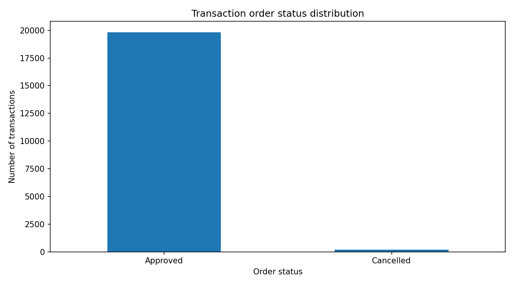
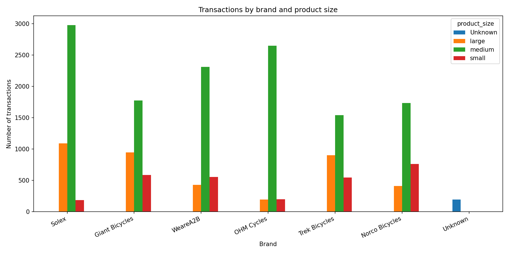
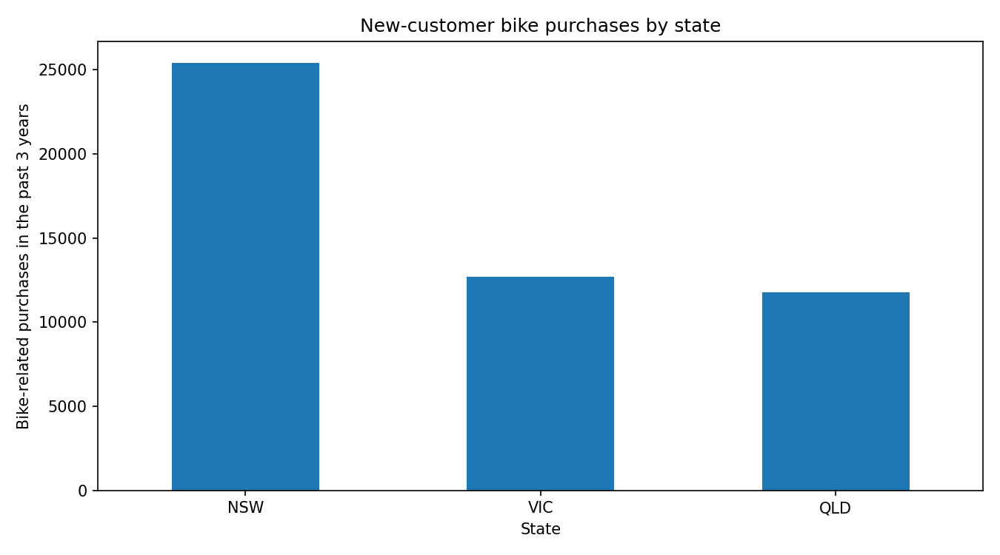
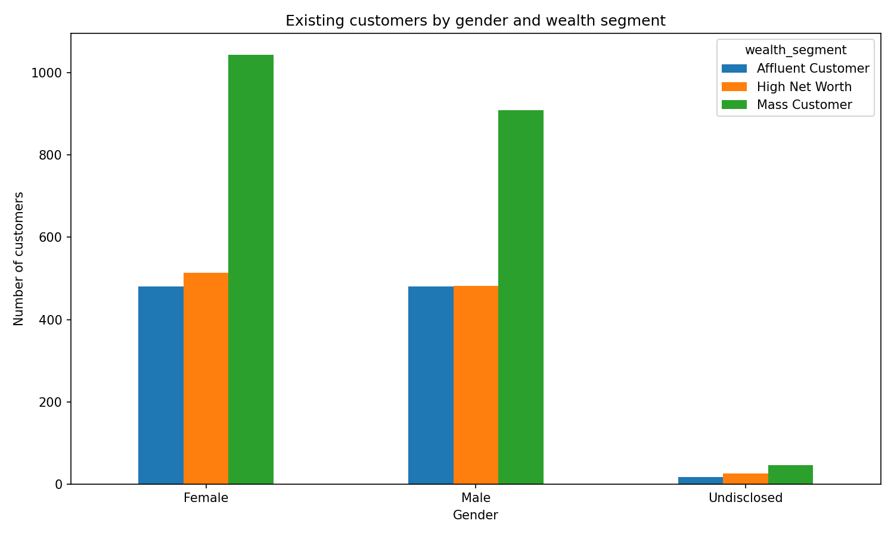

# Sprocket Central Customer Analytics with Python

This is a Python data analysis project based on a KPMG-style Sprocket Central practice dataset. The project cleans customer and transaction data, explores business patterns, and produces summary tables and visualisations that can support customer targeting and sales analysis.

> **Portfolio goal:** demonstrate practical Data Analyst skills in Excel data import, data cleaning, exploratory data analysis, summary reporting, visualisation, and clear business communication using Python.

---

## Business problem

Sprocket Central wants to better understand its customer base and transaction history. The analysis focuses on four questions:

1. How reliable is the transaction/order process?
2. Which bicycle brands and product sizes are most popular?
3. Which states show the strongest activity among new customers?
4. How are existing customers distributed by gender and wealth segment?

---

## Dataset

The workbook contains four main sheets:

| Sheet | Description |
|---|---|
| `Transactions` | Historical transaction records, order status, brand, product size, list price, and standard cost. |
| `NewCustomerList` | New customer prospects with demographic and purchase-related information. |
| `CustomerDemographic` | Existing customer demographics, wealth segment, tenure, and purchase history. |
| `CustomerAddress` | Customer location and property valuation data. |

The raw Excel file is stored locally in `data/raw/`, but `.gitignore` prevents it from being committed by default. Only make the dataset public if you are sure that redistribution is allowed.

---

## Tools used

- Python
- pandas
- NumPy
- Matplotlib
- Seaborn
- Jupyter Notebook
- Excel workbook input via `openpyxl`

---

## Project workflow

1. Loaded all relevant sheets from the Excel workbook.
2. Reviewed missing values and inconsistent categories.
3. Cleaned gender labels such as `F`, `M`, and `Femal`.
4. Standardised state labels such as `New South Wales` to `NSW`.
5. Created a transaction-level `profit` field from `list_price - standard_cost`.
6. Built summary tables for order status, brand profitability, new-customer activity, and customer segments.
7. Created visualisations and exported results to `reports/`.

---

## Key findings

- **Order performance is strong:** 19,821 of 20,000 transactions were approved, representing **99.1%** of all transactions.
- **Solex has the highest transaction count:** 4,253 transactions.
- **WeareA2B generated the highest total profit:** approximately **2.75 million** in the transaction data.
- **Medium-size products dominate** most brand categories.
- **NSW is the strongest new-customer state:** 506 new customers and 25,409 recent bike-related purchases.
- **Mass Customers are the largest wealth segment** among existing customers for both female and male customers.

---

## Visual outputs

### Order status distribution



### Transactions by brand and product size



### New-customer bike purchases by state



### Existing customers by gender and wealth segment



---

## Repository structure

```text
kpmg-sprocket-customer-analysis/
├── data/
│   ├── raw/                         # Local raw Excel file, ignored by Git by default
│   ├── processed/                   # Cleaned CSV outputs
│   └── README.md
├── notebooks/
│   └── 01_kpmg_sprocket_customer_analysis.ipynb
├── reports/
│   ├── figures/                     # Exported visualisations
│   └── tables/                      # Summary CSV files
├── src/
│   └── kpmg_sprocket_analysis.py    # Reusable cleaning and analysis functions
├── run_analysis.py                  # Command-line analysis runner
├── requirements.txt
├── .gitignore
└── README.md
```

---

## How to run the project

Clone the repository, create a virtual environment, and install the dependencies:

```bash
python -m venv .venv
```

On Windows:

```bash
.venv\Scripts\activate
```

On macOS/Linux:

```bash
source .venv/bin/activate
```

Install dependencies:

```bash
pip install -r requirements.txt
```

Run the full analysis pipeline:

```bash
python run_analysis.py
```

Open the notebook:

```bash
jupyter notebook notebooks/01_kpmg_sprocket_customer_analysis.ipynb
```

---

## Skills demonstrated

- Importing and working with multi-sheet Excel data
- Data cleaning and category standardisation
- Handling missing and inconsistent values
- Creating calculated fields for business analysis
- Grouping, aggregation, and summary-table creation
- Exploratory data analysis with Python
- Data visualisation for business reporting
- Writing reusable Python functions
- Structuring a GitHub portfolio project professionally

---

## Possible next improvements

- Build an interactive Power BI or Tableau dashboard from the cleaned CSV outputs.
- Add customer segmentation using RFM-style features.
- Combine demographic and transaction data to identify high-value customer profiles.
- Add more advanced customer ranking/scoring for marketing recommendations.
